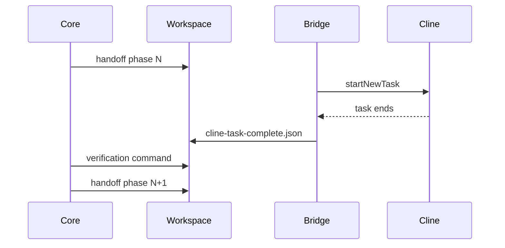

# Build Pipeline Protokolü (TR)

## Dosyalar

| Dosya | Yazan | Okuyan |
|-------|-------|--------|
| `.sauron/build-pipeline.json` | Core | Core UI |
| `.sauron/handoff-*.json` | Core | Bridge → Cline |
| `.sauron/cline-task-complete.json` | Bridge | Core |

## Handoff alanları (v2+)

```json
{
  "projectType": "electron-core",
  "pipelineId": "pipeline-...",
  "pipelinePhase": 2,
  "pipelineTotalPhases": 3,
  "autoChain": true,
  "verification": { "command": "npm test" }
}
```

## Faz geçişi



## Cline fork API

- `getTaskState()` — aktif görev var mı
- `clearTask()` — autoChain çakışma çözümü
- `getLastTaskSummary()` — complete artifact özeti

## Kayıtlı pipeline'lar

- `corporate-web-v1` (4 faz)
- `self-improve-feature-v1` (3 faz)
- `bridge-agent-v1` (2 faz)
- `monorepo-stack-v1` (3 faz)
