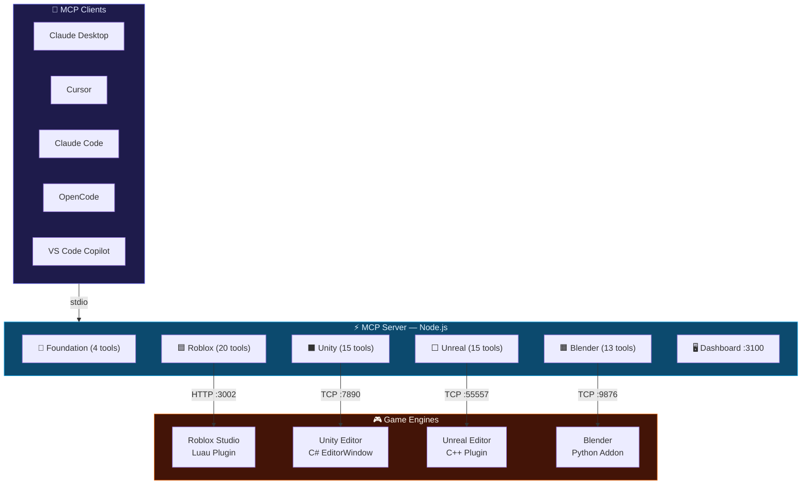
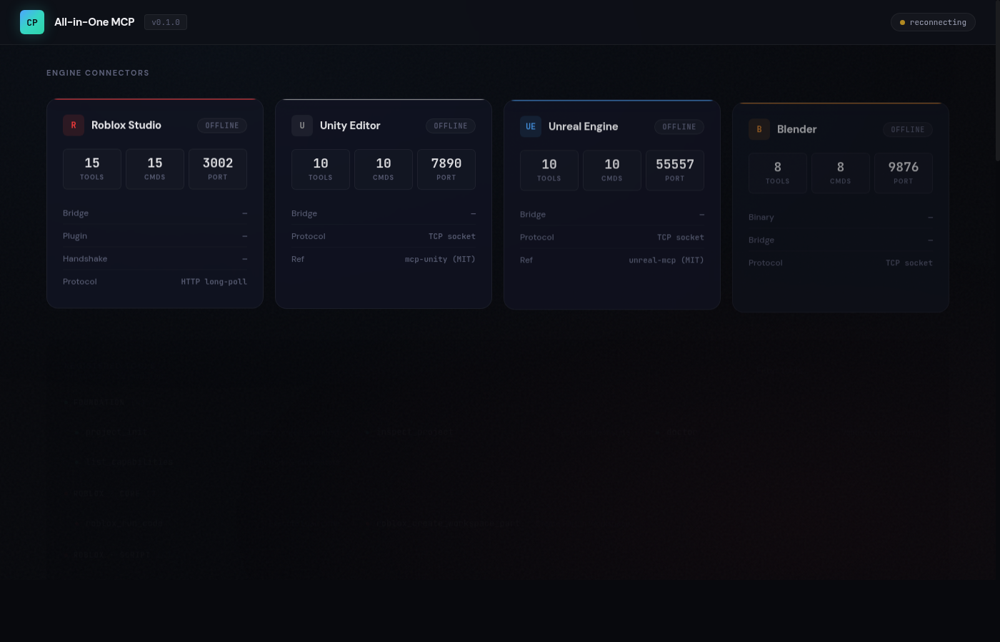

<div align="center">

# 🎮 Gamedev All-in-One MCP

### One Server. Four Engines. 67 Tools. Zero Friction.

**The first open-source MCP server that unifies Roblox Studio, Unity, Unreal Engine, and Blender into a single AI-powered control plane.**

[](LICENSE)
[](https://nodejs.org)
[](https://www.typescriptlang.org)
[](https://modelcontextprotocol.io)
[](#tool-inventory-67-tools)
[](#supported-engines)
[](#)

<br />

[**Quick Start**](#-quick-start) · [**Features**](#-features) · [**Architecture**](#-architecture) · [**Tool Inventory**](#-tool-inventory-67-tools) · [**Dashboard**](#-web-dashboard) · [**Contributing**](#-contributing)

<br />

```
"Hey Claude, create a red spinning cube in Unity, then replicate it in Roblox and Blender."
```

</div>

---

## ✨ Features

<table>
<tr>
<td width="50%">

### 🔧 67 MCP Tools
Across 12 modules — scene management, scripting, instance CRUD, physics simulation per engine.

### 🌉 4 Engine Connectors
Auto-reconnecting bridges for Roblox (HTTP), Unity (TCP), Unreal (TCP), and Blender (TCP).

### 🤖 Built-in AI Console
Chat with Claude, GPT-4o, or Gemini directly from the dashboard — tools auto-execute.

</td>
<td width="50%">

### 🖥️ Web Dashboard
Real-time SSE monitoring at `localhost:3100` with glassmorphism dark theme UI.

### ⚡ Physics Engine
Per-engine gravity, rigid bodies, constraints, raycasting, force/impulse simulation.

### 🔌 Universal Compatibility
Works with Claude Desktop, Cursor, Claude Code, OpenCode, VS Code Copilot, and any MCP client.

</td>
</tr>
</table>

---

## 🎯 Supported Engines

<table>
<tr>
<td align="center" width="25%">
<br />

<br /><br />
<b>20 tools</b><br />
HTTP Long-Poll Bridge<br />
Port <code>3002</code><br />
<sub>Luau Plugin Included</sub>
<br /><br />
</td>
<td align="center" width="25%">
<br />

<br /><br />
<b>15 tools</b><br />
TCP Socket Bridge<br />
Port <code>7890</code><br />
<sub>C# EditorWindow</sub>
<br /><br />
</td>
<td align="center" width="25%">
<br />

<br /><br />
<b>15 tools</b><br />
TCP Socket Bridge<br />
Port <code>55557</code><br />
<sub>C++ Plugin</sub>
<br /><br />
</td>
<td align="center" width="25%">
<br />

<br /><br />
<b>13 tools</b><br />
TCP Socket Bridge<br />
Port <code>9876</code><br />
<sub>Python Addon</sub>
<br /><br />
</td>
</tr>
</table>

---

## 🚀 Quick Start

```bash
# Clone the repo
git clone https://github.com/nicepkg/gamedev-all-in-one.git
cd gamedev-all-in-one

# Install & build
npm install
npm run build

# Start the server
npm run dev
```

Then open **http://127.0.0.1:3100** for the web dashboard.

### MCP Client Configuration

Add to your MCP client config (Claude Desktop, Cursor, etc.):

```json
{
  "mcpServers": {
    "gamedev-all-in-one": {
      "command": "node",
      "args": ["/absolute/path/to/gamedev-all-in-one/dist/index.js"]
    }
  }
}
```

---

## 🏗 Architecture



---

## 📦 Tool Inventory (67 tools)

<details>
<summary><b>🔧 Foundation — 4 tools</b></summary>

| Tool | Description |
|:-----|:------------|
| `project_init` | Initialize project manifest |
| `inspect_project` | Read manifest state |
| `doctor` | Validate environment and connectors |
| `list_capabilities` | List all tools and connector status |

</details>

<details>
<summary><b>🟦 Roblox — 20 tools</b></summary>

| Category | Tools |
|:---------|:------|
| **Core** (2) | `roblox_run_code` · `roblox_create_workspace_part` |
| **Script** (4) | `roblox_get_script_source` · `roblox_set_script_source` · `roblox_edit_script_lines` · `roblox_grep_scripts` |
| **Instance** (5) | `roblox_create_instance` · `roblox_delete_instance` · `roblox_set_property` · `roblox_clone_instance` · `roblox_reparent_instance` |
| **Query** (4) | `roblox_get_instance_properties` · `roblox_get_instance_children` · `roblox_search_instances` · `roblox_get_file_tree` |
| **Physics** (5) | `roblox_set_gravity` · `roblox_set_physics` · `roblox_add_constraint` · `roblox_raycast` · `roblox_simulate_physics` |

</details>

<details>
<summary><b>⬛ Unity — 15 tools</b></summary>

| Category | Tools |
|:---------|:------|
| **Core** (10) | `unity_get_hierarchy` · `unity_get_gameobject` · `unity_create_gameobject` · `unity_delete_gameobject` · `unity_set_component_property` · `unity_add_component` · `unity_set_transform` · `unity_get_script_source` · `unity_play_mode` · `unity_execute_menu_item` |
| **Physics** (5) | `unity_set_gravity` · `unity_add_rigidbody` · `unity_add_joint` · `unity_raycast` · `unity_apply_force` |

</details>

<details>
<summary><b>⬜ Unreal Engine — 15 tools</b></summary>

| Category | Tools |
|:---------|:------|
| **Core** (10) | `unreal_get_world_outliner` · `unreal_get_actor` · `unreal_spawn_actor` · `unreal_destroy_actor` · `unreal_set_actor_transform` · `unreal_set_actor_property` · `unreal_get_blueprint` · `unreal_run_python` · `unreal_play_mode` · `unreal_get_viewport_screenshot` |
| **Physics** (5) | `unreal_set_gravity` · `unreal_set_simulate_physics` · `unreal_add_physics_constraint` · `unreal_raycast` · `unreal_apply_force` |

</details>

<details>
<summary><b>🟧 Blender — 13 tools</b></summary>

| Category | Tools |
|:---------|:------|
| **Core** (8) | `blender_get_scene` · `blender_get_object` · `blender_create_object` · `blender_delete_object` · `blender_set_transform` · `blender_set_material` · `blender_run_python` · `blender_export` |
| **Physics** (5) | `blender_set_gravity` · `blender_setup_rigid_body` · `blender_add_constraint` · `blender_bake_physics` · `blender_apply_force` |

</details>

---

## 🖥️ Web Dashboard

The built-in dashboard at **http://127.0.0.1:3100** features a dark glassmorphism UI:

<p align="center">
  
</p>


| Panel | Description |
|:------|:------------|
| **Engine Status** | Real-time connection status for all 4 engines with animated glow effects |
| **AI Console** | Chat with Claude / GPT-4o / Gemini — auto-executes engine tools |
| **Tool Registry** | All 67 tools with color-coded engine dots and live search |
| **Event Log** | SSE-powered real-time stream of connections, tool calls, and errors |

### AI Console Providers

| Provider | Models |
|:---------|:-------|
| **Anthropic** | Claude Opus 4.6, Claude Sonnet 4.6, Claude Haiku 4.5 |
| **OpenAI** | GPT-5.4, GPT-5.4 Mini, GPT-5.4 Nano, o3, o4-mini |
| **Google** | Gemini 2.5 Pro, Gemini 2.5 Flash, Gemini 2.5 Flash-Lite |

> API keys are stored in **localStorage only** — never sent to or stored on the server.

---

## 🔌 Roblox Studio Plugin

A production-ready single-file plugin is included.

### Installation

1. Copy `runtime/roblox-studio-plugin/GamedevAllInOne.server.lua` to your Plugins folder:
   - **Windows**: `%LOCALAPPDATA%\Roblox\Plugins\`
   - **Mac**: `~/Documents/Roblox/Plugins/`
2. Restart Roblox Studio
3. Enable: **Game Settings > Security > Allow HTTP Requests = ON**
4. Start the server with `npm run dev`
5. Plugin auto-connects on load

### Plugin Features

- 20 command handlers (script CRUD, instance CRUD, physics, raycast)
- Auto-handshake with bridge on startup
- HTTP long-poll command loop with `pcall`-wrapped requests
- Toolbar button to start/stop runtime

---

## 🌉 Bridge Architecture

| Engine | Protocol | Port | Reconnect | Plugin |
|:-------|:---------|:-----|:----------|:-------|
| Roblox | HTTP long-poll | `3002` | N/A | Luau plugin (included) |
| Unity | TCP socket | `7890` | Auto | C# EditorWindow |
| Unreal | TCP socket | `55557` | Auto | C++ Plugin |
| Blender | TCP socket | `9876` | Auto | Python Addon |

> All bridges bind to `127.0.0.1` only. TCP bridges auto-reconnect with configurable intervals.

---

## ⚙️ Configuration

### Environment Variables

| Variable | Default | Description |
|:---------|:--------|:------------|
| `WEB_DASHBOARD_PORT` | `3100` | Dashboard HTTP port |
| `WEB_DASHBOARD_ENABLED` | `true` | Set `false` to disable dashboard |
| `ROBLOX_LUAU_BRIDGE_PORT` | `3002` | Roblox Luau bridge port |
| `UNITY_BRIDGE_PORT` | `7890` | Unity TCP bridge port |
| `UNREAL_BRIDGE_PORT` | `55557` | Unreal TCP bridge port |
| `BLENDER_BRIDGE_PORT` | `9876` | Blender TCP bridge port |

---

## 🔒 Security

- **Loopback only** — all bridges bind to `127.0.0.1`
- **Host validation** — requests with invalid Host headers are rejected
- **Origin-restricted CORS** — only localhost origins permitted
- **Body size limits** — 1 MiB max on Luau bridge, 64 KiB on dashboard API
- **Input validation** — Zod schemas on all bridge endpoints
- **No server-side secrets** — API keys live in browser localStorage only
- **Graceful degradation** — port conflicts disable individual services without crashing

---

## 🛠 Development

```bash
npm run dev          # Start with tsx (hot reload)
npm run build        # TypeScript compile + copy dashboard
npm start            # Production mode
npm test             # Run tests
```

### Project Structure

```
src/
├── index.ts                        # Entry point + graceful shutdown
├── version.ts                      # NAME, VERSION constants
├── server/
│   └── create-server.ts            # McpServer + 12 tool module registration
├── connectors/
│   ├── shared/tcp-bridge.ts        # Shared TCP bridge (Unity/Unreal/Blender)
│   ├── roblox/index.ts             # Roblox detection + command dispatch
│   ├── luau/bridge.ts              # HTTP long-poll bridge (hardened)
│   ├── unity/index.ts              # Unity detection + TCP bridge
│   ├── unreal/index.ts             # Unreal detection + TCP bridge
│   └── blender/index.ts            # Blender detection + TCP bridge
├── tools/
│   ├── foundation.ts               # 4 foundation tools
│   ├── roblox*.ts                  # 20 Roblox tools (5 files)
│   ├── unity*.ts                   # 15 Unity tools (2 files)
│   ├── unreal*.ts                  # 15 Unreal tools (2 files)
│   └── blender*.ts                 # 13 Blender tools (2 files)
└── web/
    ├── server.ts                   # Dashboard HTTP + SSE + Chat API
    ├── llm-proxy.ts                # Multi-provider LLM with tool execution
    └── dashboard.html              # Single-file frontend (dark theme)

runtime/
└── roblox-studio-plugin/
    └── GamedevAllInOne.server.lua  # Production-ready Studio plugin
```

---

## 🤝 Contributing

Contributions are welcome! Here's how to get started:

1. **Fork** the repository
2. **Create** a feature branch: `git checkout -b feat/amazing-feature`
3. **Commit** your changes: `git commit -m 'feat: add amazing feature'`
4. **Push** to the branch: `git push origin feat/amazing-feature`
5. **Open** a Pull Request

### Areas We'd Love Help With

- 🎮 **Engine plugins** — C# EditorWindow for Unity, C++ plugin for Unreal, Python addon for Blender
- 🧪 **Tests** — unit tests, integration tests, E2E bridge tests
- 📚 **Docs** — tutorials, video walkthroughs, example prompts
- 🌐 **i18n** — translations for the dashboard UI
- 🔧 **New tools** — animation, audio, terrain, lighting tools per engine

---

## 📚 Upstream References

<details>
<summary>Projects that inspired this work</summary>

| Engine | Project | License |
|:-------|:--------|:--------|
| Roblox | `boshyxd/robloxstudio-mcp` | MIT |
| Roblox | `yannyhl/linkedsword-mcp` | MIT |
| Roblox | `Roblox/studio-rust-mcp-server` | Official |
| Unity | `CoderGamester/mcp-unity` | MIT |
| Unity | `CoplayDev/unity-mcp` | MIT |
| Unreal | `chongdashu/unreal-mcp` | MIT |
| Unreal | `kevinpbuckley/VibeUE` | MIT |
| Blender | `ahujasid/blender-mcp` | MIT |
| Blender | `poly-mcp/Blender-MCP-Server` | MIT |
| Physics | `KAIST-M4/MCP-SIM` | — |

</details>

---

## 📄 License

**AGPL-3.0-only** — see [LICENSE](LICENSE) for details.

- Improvements to the server must remain open source
- Networked or hosted variants must not become closed forks
- MIT and Apache-2.0 upstream code adapted with attribution preserved

---

<div align="center">

**If this project helps your game development workflow, give it a ⭐**

<br />

Made with ❤️ by the open-source community

<br />

[](https://star-history.com/#nicepkg/gamedev-all-in-one&Date)

</div>
